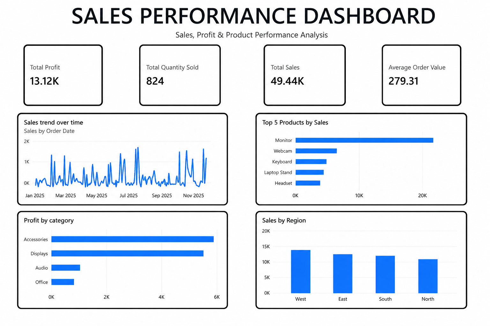

# Sales Performance Dashboard — Power BI

## 📊 Project Overview

This project presents an interactive Power BI dashboard designed to analyze sales performance, profitability, product performance, and regional trends.

The dashboard transforms sales transaction data into clear business-focused KPIs and visualizations to support performance analysis and decision-making.

## 🎯 Objectives

- Monitor overall sales and profit performance
- Track total quantity sold and average order value
- Analyze sales trends over time
- Identify the highest-performing products
- Compare sales performance across regions
- Evaluate profitability across product categories

## 🛠️ Tools & Skills

- Power BI
- DAX
- Data Cleaning & Transformation
- Data Modeling
- Data Visualization
- KPI Development
- Business Intelligence
- Business Analysis

## 📈 Key Performance Indicators

| Metric | Result |
|---|---:|
| Total Sales | ₹49,437.38 |
| Total Profit | ₹13,119.50 |
| Total Quantity Sold | 824 |
| Average Order Value | ₹279.31 |

## 📊 Dashboard Features

### Sales Trend Over Time
Tracks sales performance across the year to identify changes and fluctuations in sales activity.

### Top 5 Products by Sales
Highlights the products generating the highest sales, with the Monitor category/product leading the ranking.

### Profit by Category
Compares profitability across business categories and identifies the categories contributing most to total profit.

### Sales by Region
Provides a regional comparison of sales performance across West, East, South, and North.

## 🔍 Analysis Approach

1. Prepared and reviewed the sales dataset.
2. Built the required data model in Power BI.
3. Created calculated measures using DAX.
4. Developed KPI cards for core business metrics.
5. Built interactive visualizations for trends, products, categories, and regions.
6. Designed the final dashboard for clear business interpretation.

## 💡 Key Insights

- Total sales reached approximately ₹49.44K.
- Total profit was approximately ₹13.12K.
- 824 units were sold across the analyzed transactions.
- The average order value was approximately ₹279.31.
- Monitor was the leading product by sales.
- The West region recorded the highest sales among the four regions.
- Accessories and Displays were the strongest categories by profit.

## 📁 Project File

- `Sales_Performance_Dashboard.pbix` — Power BI dashboard and data model
- `powerbi-dashboard.png` — Dashboard preview

## 📊 Dashboard Preview

## 👤 Author

**Ayush Rabotra**

Aspiring Data Analyst | Power BI | Excel | SQL
